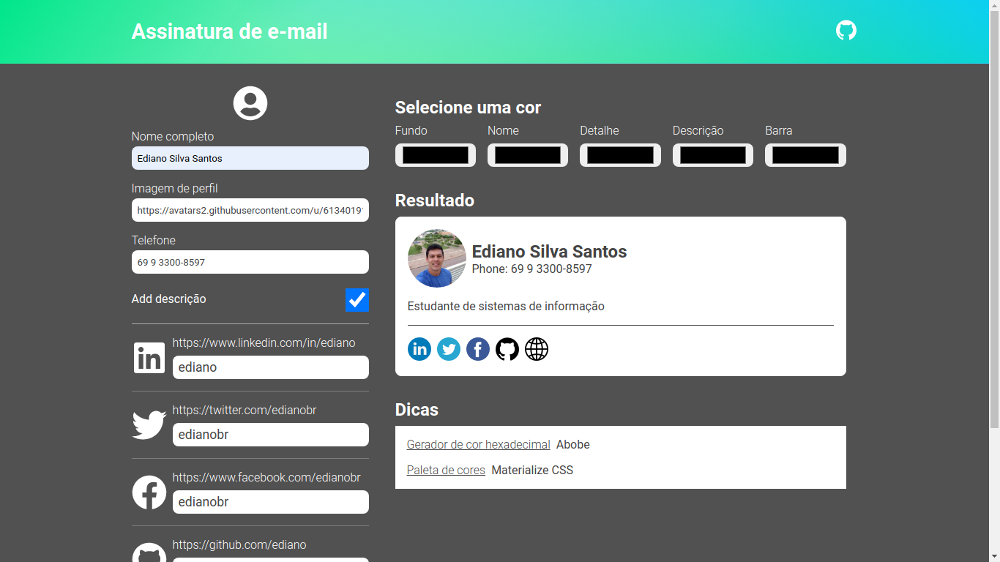

# Mail Signature

Este é um pequeno projeto, simples e open source. O objetivo aqui é facilitar a criação de assinaturas para e-mail.



## Stacks

* Next.js
* Styled components
* React icons

É possível consumir o projeto de duas formas, a primeira é pela própria página em produção, a segunda é iniciando um servidor localmente na máquina.

## Iniciando localmente

Para iniciar o projeto localmente, certifique de ter o node.js com npm ou yarn instalado no sistema, em seguida instale as dependências do projeto.

```bash
npm i
```

ou

```bash
yarn
```

Como as dependências instaladas, podemos iniciar o servidor.

```bash
npm run dev
```

ou

```bash
yarn dev
```

Agora acesse http://localhost:3000

## Ediano Silva Santos

[](https://twitter.com/edianobr)
[](https://www.linkedin.com/in/ediano)
[](mailto:silva.ediano.santos@gmail.com)
